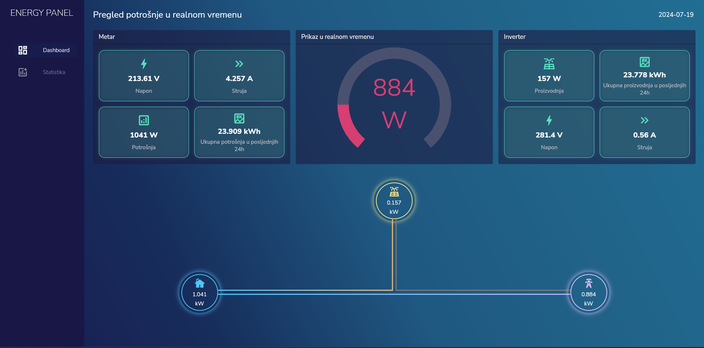
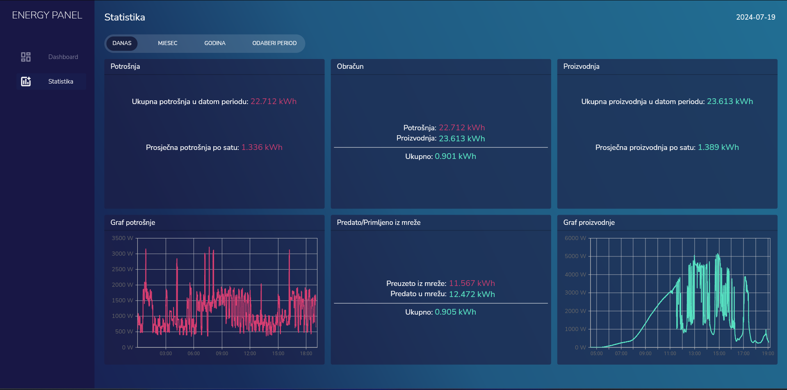

# EnergyPanel

EnergyPanel is an application that presents and saves the values of energy produced from solar panels and power consumption. It features real-time data and comprehensive statistics to help you monitor and manage your energy usage effectively.

## Features

### Real-Time Monitoring

- **Real-Time Data Display:** Monitor the current voltage, current, and power consumption.
- **Real-Time Production:** View the real-time energy production from your solar panels.
- **Instantaneous Power Flow:** Visual representation of power flow between the grid, inverter, and home.

### Statistics

- **Daily, Monthly, and Yearly Data:** Analyze your energy consumption and production over different time periods.
- **Detailed Consumption Metrics:** Total consumption for a selected period and average consumption per hour.
- **Detailed Production Metrics:** Total production for a selected period and average production per hour.
- **Net Energy Usage:** Calculation of net energy usage by comparing consumption and production.

### Graphical Representations

- **Consumption Graph:** Visualize your power consumption trends over the selected period.
- **Production Graph:** Visualize your energy production trends over the selected period.
- **Net Energy Flow:** Track the amount of energy received from and sent to the grid.

## Technology Stack

- **Frontend:** Flutter
- **Backend:** Python Flask
- **Database:** MongoDB

## Screenshots

### Real-Time Data

### Statistics

## Data Logging

The application features scripts that log data from the solar inverter and consumption meter into MongoDB, ensuring accurate recording and easy access for analysis.
